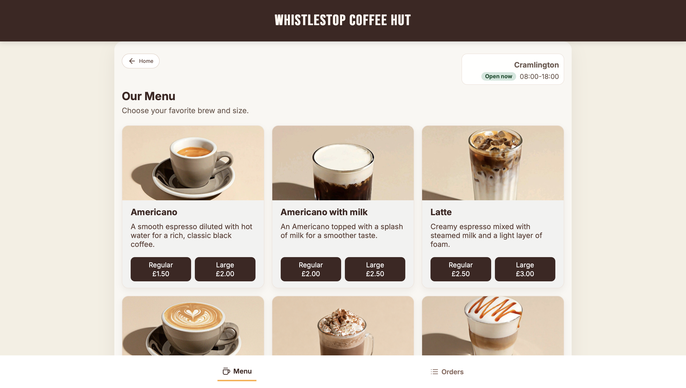
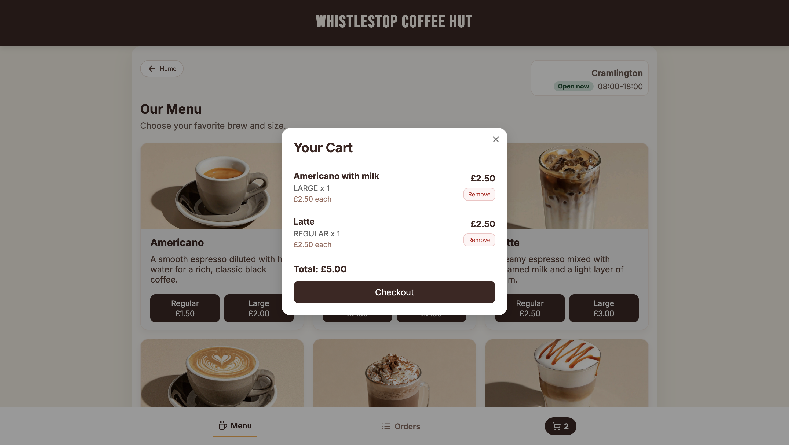
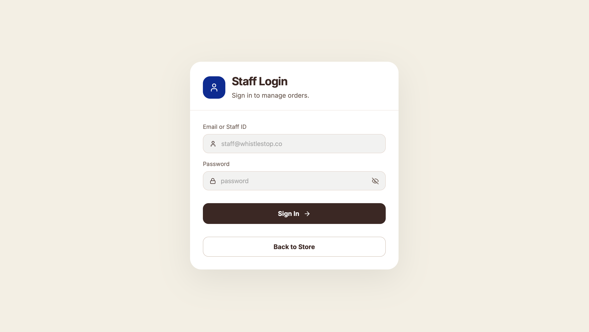
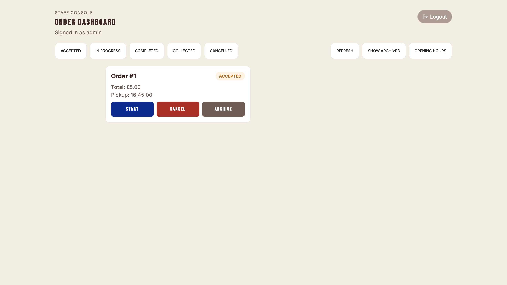

# Whistlestop Coffee Hut

Multi-station coffee ordering system built for a kiosk at Cramlington Station. Customers browse the menu, place orders for a chosen pickup time, and track order status. Staff manage incoming orders through a dashboard, update statuses, and archive completed orders.

## Tech Stack

| Layer | Technology |
|---|---|
| Frontend | Vue 3, Vite, Pinia, Vue Router |
| Backend | Java 21, Spring Boot 3 |
| Database | MySQL |
| Auth | JWT (JSON Web Tokens) |
| Payment | [HorsePay](http://homepages.cs.ncl.ac.uk/daniel.nesbitt/CSC8019/HorsePay/HorsePay.php) external gateway |
| Containerisation | Docker |

## Features

- Browse coffee menu with sizes and pricing
- Place orders with pickup time selection, validated against station opening hours
- Real-time order status tracking (accepted → in progress → ready → collected)
- Staff dashboard with order management and status updates
- Configurable station opening hours (weekday, Saturday, Sunday toggle)
- JWT-authenticated staff login
- External payment processing via HorsePay API
- Order archiving for completed orders
- Mobile-first responsive design

## Architecture

```
┌─────────────┐     ┌──────────────────────────────────────────────┐     ┌─────────┐
│   Vue 3 SPA │────▶│           Spring Boot REST API               │────▶│  MySQL  │
│  (Vite dev) │◀────│  Controller → Service → Repository pattern   │◀────│         │
└─────────────┘     └──────────────────────────────────────────────┘     └─────────┘
                                      │
                                      ▼
                            ┌─────────────────┐
                            │   HorsePay API   │
                            │ (external gateway)│
                            └─────────────────┘
```

The backend follows a layered architecture: **Controller → DTO → Service → Repository → Database**. Each domain (orders, stations, menu items, users, auth, checkout) is separated into its own package with dedicated controllers, services, DTOs, models, and repositories.

The frontend uses Pinia stores for state management and a shared `apiClient` module for all HTTP communication with the backend.

## Payment Integration

Order creation and payment processing are decoupled:

1. **Order creation** (`POST /api/v1/order`) — validates pickup time against the station's configured opening hours, then persists the order.
2. **Payment processing** (`POST /api/v1/checkout/pay`) — delegates to [HorsePay](http://homepages.cs.ncl.ac.uk/daniel.nesbitt/CSC8019/HorsePay/HorsePay.php), an external payment gateway.

This mirrors real-world async payment flows (Stripe webhooks, PayPal IPN). If the gateway is unavailable, the order is still saved and the customer is informed that payment confirmation is pending.

## Getting Started

### Prerequisites

- Java 17+
- Node.js 18+
- MySQL 8+

### Backend

```bash
cd backend
# Create MySQL database using the SQL script
mysql -u root -p < "sql scripts/coffee_shop.sql"
# Run with dev profile (uses local MySQL, hardcoded JWT secret)
mvn spring-boot:run -Dspring-boot.run.profiles=dev
```

### Frontend

```bash
cd frontend
npm install
npm run dev
```

The app runs at `http://localhost:5173` by default.

## Docker

> Docker containerisation was not required by the project brief. I added it to practice and build familiarity with containerised deployments.

Three services: **frontend** (nginx), **backend** (Spring Boot), and **db** (MySQL 8.0).

```bash
# 1. Copy .env.example and fill in your values
cp .env.example .env

# 2. Build and start all containers
docker compose up --build

# 3. Stop all containers
docker compose down
```

| Service | URL | Port |
|---|---|---|
| Frontend | http://localhost | 80 |
| Backend API | http://localhost:8080 | 8080 |
| MySQL | localhost | 3306 |

Configuration is managed through a `.env` file (gitignored) — see `.env.example` for required variables. Database data persists in a Docker volume between restarts.

## Screenshots







## Contribution Acknowledgments

Originally built as a team project for CSC8019 at Newcastle University. My contributions: purchase order backend flow (creation, status updates, archiving), backend test suite, backend standardisation and consistency, Docker containerisation, deployment, and UI design enhancements. Published with teammates' permission.

---

*All images used in the web application were generated with AI.*
